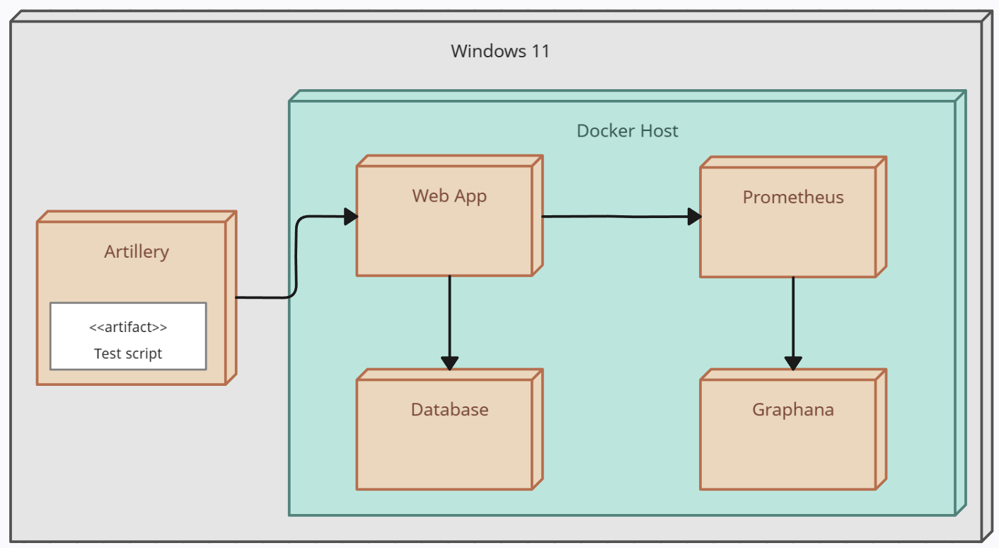

# Load Testing

To achieve an objective comparison among the [fourteen versions](../app_variations/) of the web application, the same load test was executed on all versions in a similar execution environment.

## Tools Used for Load Testing

The goal of this project is to analyze performance differences across various versions of the application. The performance was analyzed from two perspectives: resource management on the machine running the web application and the application's performance itself, including response times and potential errors experienced by users.

### Monitoring and Observability Tools

Two open-source tools were used for monitoring and observability: Grafana and Prometheus.

- **Grafana**: A data visualization and analysis platform that creates interactive, real-time dashboards. Grafana was used to obtain performance metrics for memory, CPU, and thread states.
- **Prometheus**: A monitoring system designed for metric collection and long-term storage. Prometheus collects data on the application's and system's state, which is then displayed in Grafana's graphs.

### Load Testing Tool

- **Artillery**: Used for load and performance testing from a user's perspective. Artillery helps understand how the application behaves under high demand by defining load tests with a configuration file, which was tailored to this project's specific needs.

### Infrastructure for Load Testing

An isolated environment was used during the tests. Docker was employed to isolate the application from the rest of the system.

The test environment had two CPU cores available. The memory for the Java Virtual Machine was limited to 500MB.

The insfraestructure of the testing environment looks like this:

### Execution of Load Tests

To accurately measure the web applications' performance, four API endpoints were tested. Artillery executed the following calls per 100 interactions:

- 70 calls to retrieve a movie by ID.
- 20 calls to retrieve a page of 20 movies.
- 9 calls to save a new movie.
- 1 call to delete a movie by ID.

The load test involved progressively making calls to the application over four minutes. The load testing definition can be found [here](../setup/load_testing/load-testing.yml)

The test execution follows these steps:
- 30 seconds at 200 user/second
- 30 seconds ramp up to 300 users
- 30 seconds at 300 user/second
- 30 seconds ramp up to 400 users
- 30 seconds at 400 user/second
- 30 seconds ramp up to 500 users
- 60 seconds at 500 user/second

## Results

The table links to the each of the comparisons where the performance of each application version is analyzed. The goal is to understand the potential benefits of running applications on virtual threads. Therefore, the analysis compares the results of equivalent versions with and without the use of virtual threads during execution.

### User Perspective Performance Data

The following metrics were analyzed from the user's perspective:
- Median response time
- 95th percentile response time
- 99th percentile response time
- Requests per second rate
- Failed requests due to timeouts

### Resource Management Data

The following resource management metrics were analyzed:
- CPU usage percentage
- JVM heap usage percentage
- Operating system thread usage

### Virtual Threads Comparisons 

|                                       | Link To comparison                                                                            |
|---------------------------------------|-----------------------------------------------------------------------------------------------|
| Spring Boot - Blocking - Mysql        | [Go to Comparison](./comparisons_virtual_threads/SpringBoot_Blocking_Mysql/README.md)         |
| Spring Boot - Non Blocking - Mysql    | [Go to Comparison](./comparisons_virtual_threads/SpringBoot_nonBlocking_Mysql/README.md)      |
| Spring Boot - Blocking - MongoDB      | [Go to Comparison](./comparisons_virtual_threads/SpringBoot_Blocking_MongoDB/README.md)       |
| Spring Boot - Non Blocking - MongoDB  | [Go to Comparison](./comparisons_virtual_threads/SpringBoot_nonBlocking_MongoDB/README.md)    |
| Quarkus - Blocking - Mysql            | [Go to Comparison](./comparisons_virtual_threads/Quarkus_Blocking_Mysql/README.md)            |
| Quarkus - Blocking - MongoDB          | [Go to Comparison](./comparisons_virtual_threads/Quarkus_Blocking_MongoDB//README.md)         |
