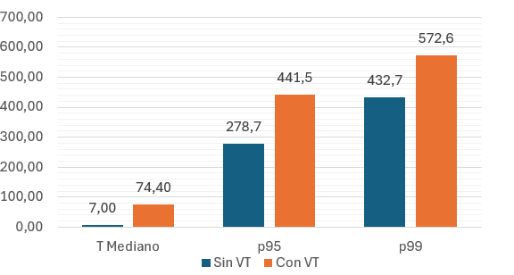
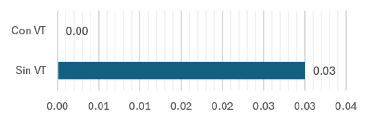
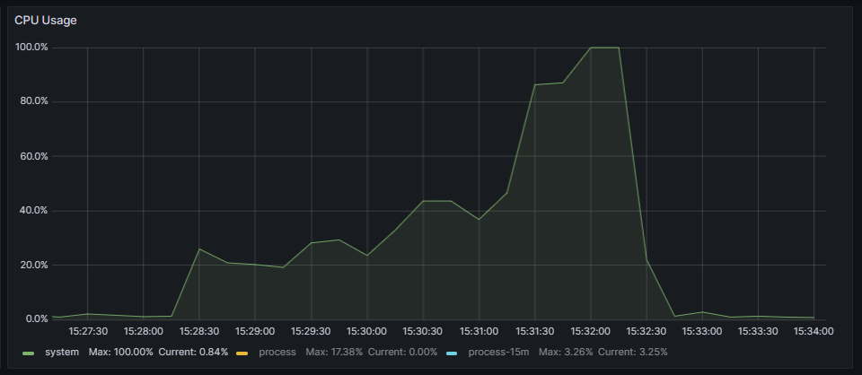
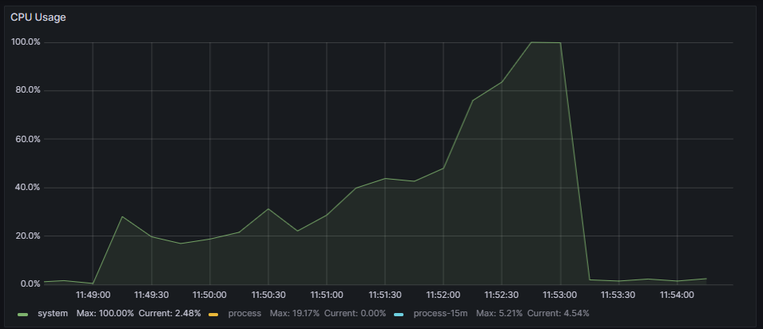
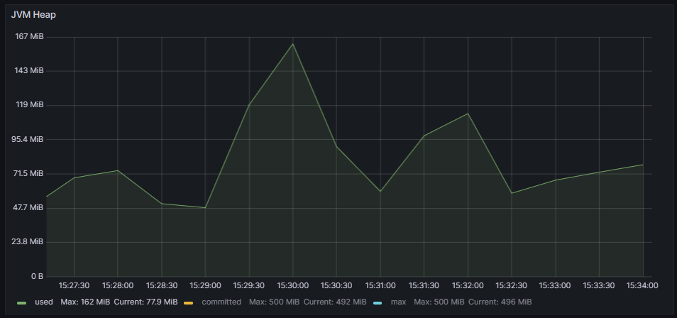
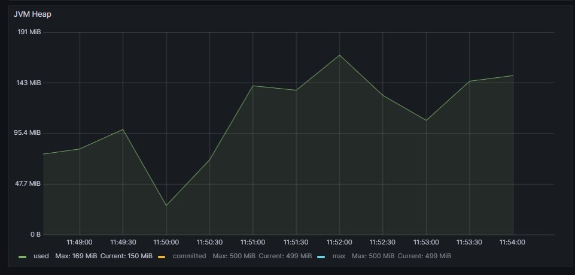
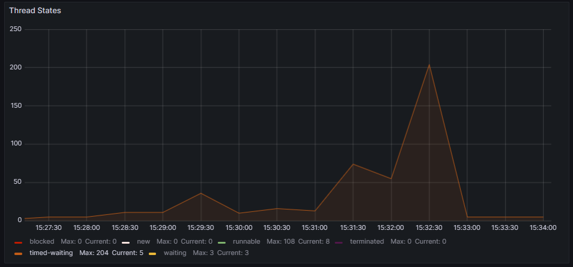
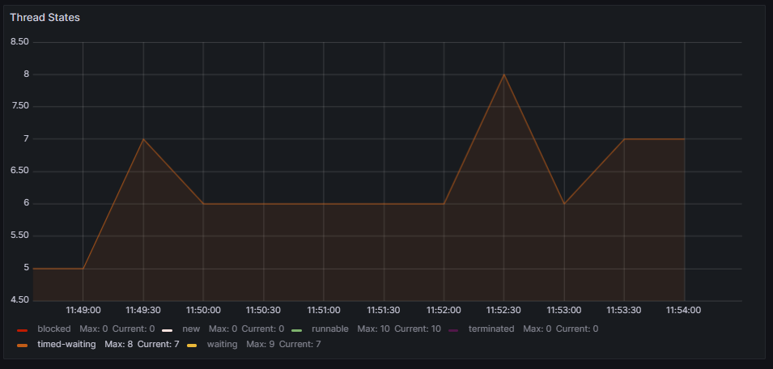

# Virtual Threads usage Comparison: Quarkus - Blocking programming approach - MongoDB

## Response times analysis
The results regarding response times (expressed in milliseconds) are shown in the following graph:

This case is similar to the [Spring Boot and MySQL one](../SpringBoot_Blocking_Mysql/), as the combination of framework and database management system does not achieve high efficiency.

In both cases, performance notably drops in the higher percentiles, with responses taking over half a second. However, response times seem to be slightly better during execution on virtual threads.

In this version, there were timeouts: 2526 during execution without virtual threads compared to 16 when virtual threads were used. The following graph shows the percentage of timeouts relative to the total number of requests made:

## Resources usage analysis

|   | Without Virtual Threads | With Virtual Threads |
|---|---|---|
| CPU |  |  |
| JVM Heap |  |  |
| Threads usage |  |  |

The resource management of the two versions is very similar. In both cases, during the last 20 seconds of the load test execution, the CPU reached 100% usage. The memory usage percentage was also similar, peaking at 32.5% without virtual threads and 33.8% with virtual threads.

Since a blocking model was used and the CPU usage limit was reached in both cases, the significant difference lies in the management of operating system threads. During execution on platform threads, there were up to 204 blocked threads, while with virtual threads, there were only 8.

## Conclusion

Therefore, it is concluded that, eventhought there were some timeouts during execution without virtual threads usage and the resoucer management is similar, the performance is clearly worse if virtual threads are used. With a Median time response over 10 times slower.
