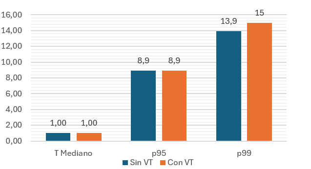
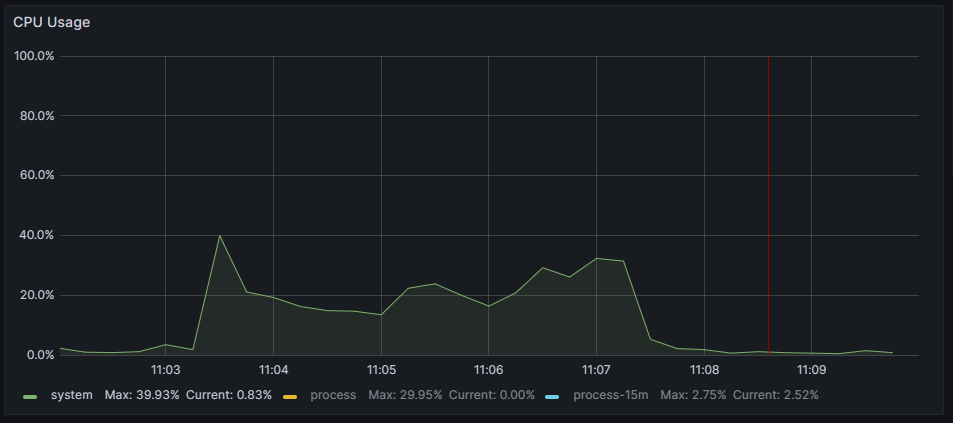
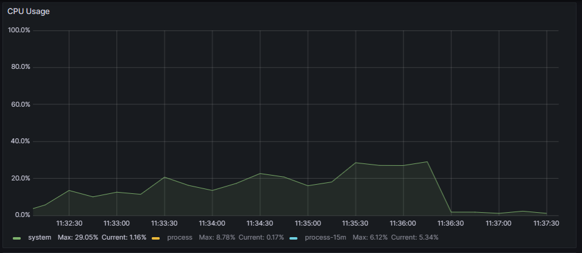
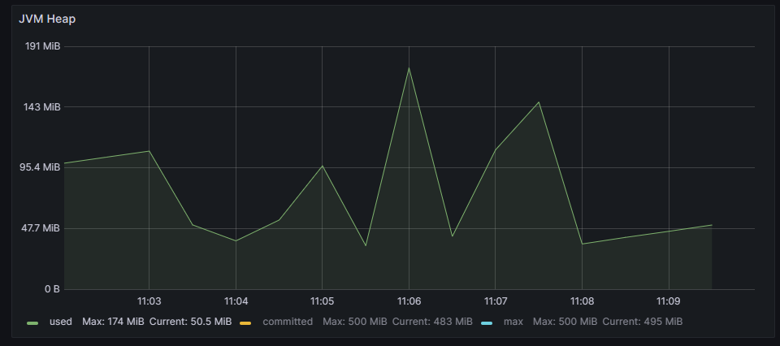
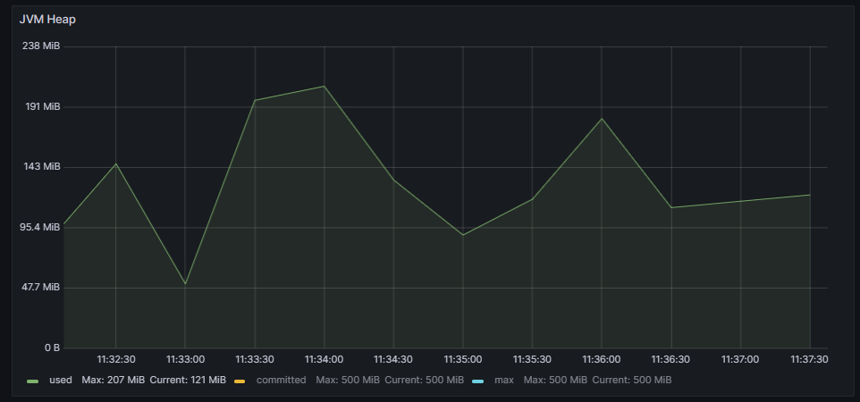
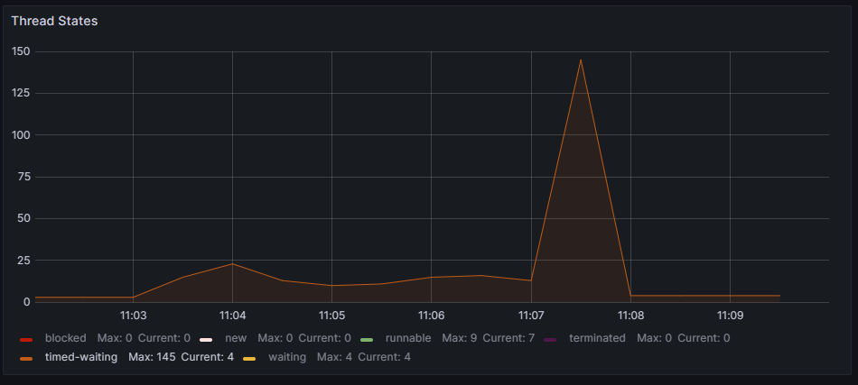
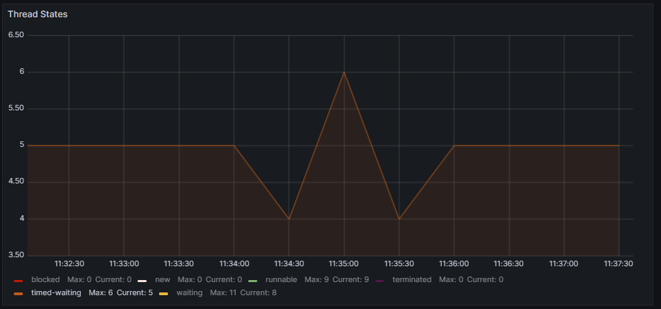

# Virtual Threads usage Comparison: Quarkus - Blocking programming approach - Mysql

## Response times analysis
The results regarding response times (expressed in milliseconds) are shown in the following graph:

While response times are very similar to each other, resource management does show significant differences.

## Resources usage analysis

|   | Without Virtual Threads | With Virtual Threads |
|---|---|---|
| CPU |  |  |
| JVM Heap |  |  |
| Threads usage |  |  |

The CPU usage percentage is lower and more balanced during the load test execution in the case of using virtual threads, always below 30% usage. CPU usage during execution on platform threads, although quite efficient, is slightly higher and peaked at 40% at the start of the load test.

JVM memory management is quite similar, and in thread management, execution on virtual threads only blocked 6 threads, while its counterpart blocked a total of 145.

## Conclusion

Although both versions perform similarly from the user's perspective, the use of virtual threads improves the efficiency of system's resource usage.
