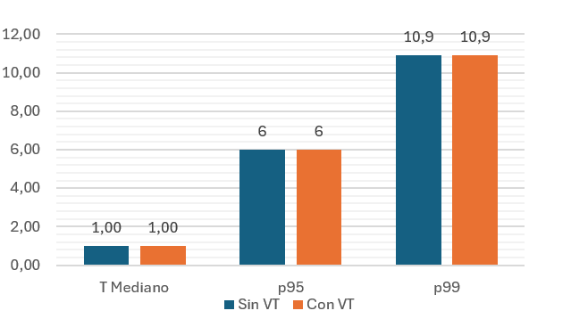
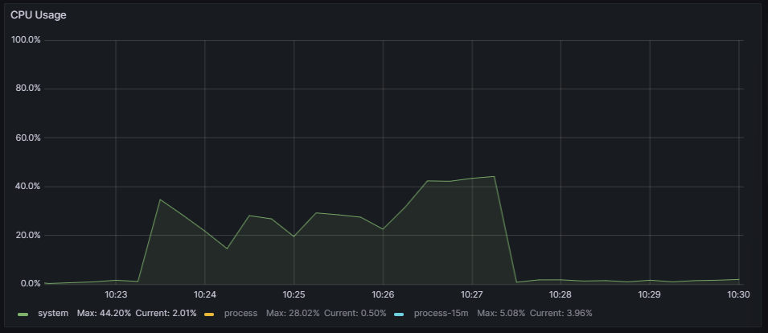
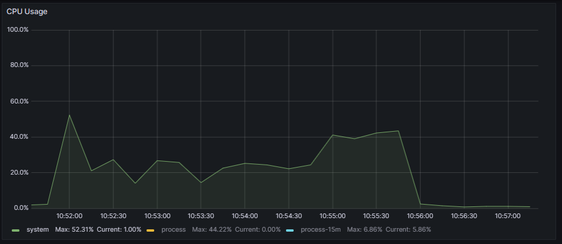
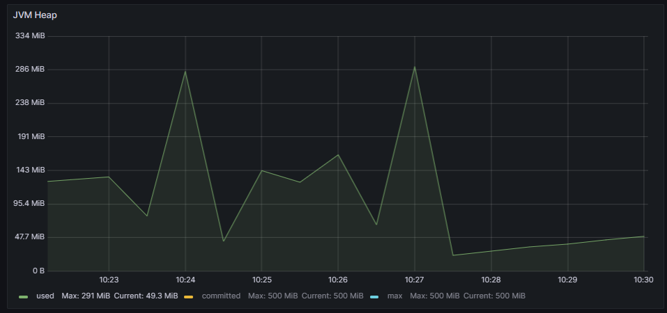
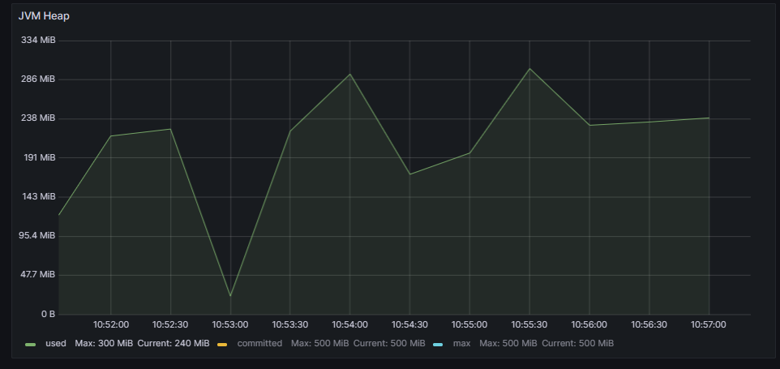
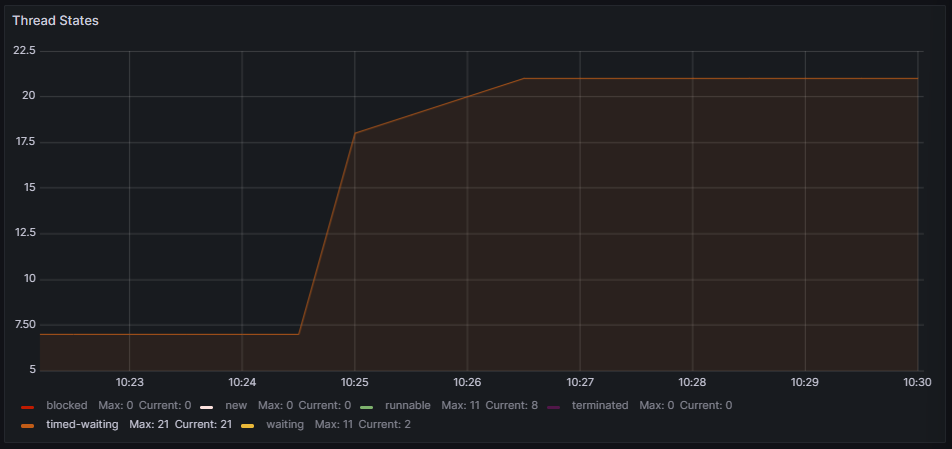
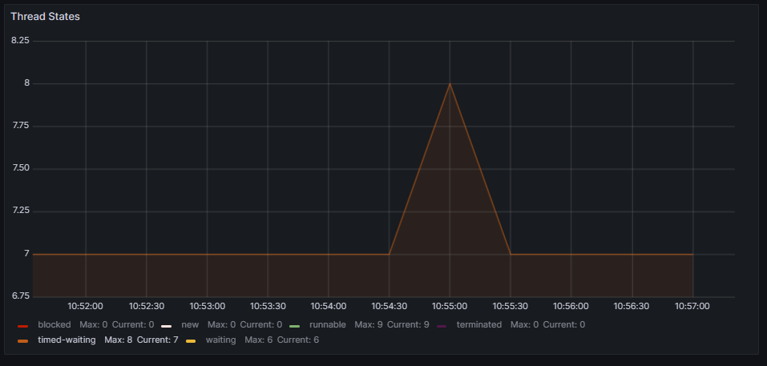

# Virtual Threads usage Comparison: Spring Boot - Blocking programming approach - MongoDB

## Response times analysis
The results regarding response times (expressed in milliseconds) are shown in the following graph:

In this specific scenario, where MongoDB was used as the database, the time response results where identical in both cases.

## Resources management analysis

|   | Without Virtual Threads | With Virtual Threads |
|---|---|---|
| CPU |  |  |
| JVM Heap |  |  |
| Threads usage |  |  |

Regarding resource management in both versions, CPU usage and JVM memory usage are similar. The biggest difference lies in the management of operating system threads. With a blocking programming model and a high workload, the version not using virtual threads should block many more threads. However, the reality is that this version of the application is so efficient that there is barely any difference.

In the execution on platform threads, 21 threads were blocked, whereas with virtual threads, only 8 were blocked. This is a much smaller difference than in the [Spring Boot - Blocking - Mysql comparison](../SpringBoot_Blocking_Mysql/), where the difference was 206 to 7.

## Conclusion

The data collected during both executions does not clearly indicate which version is more efficient. In both cases, performance is very similar.
