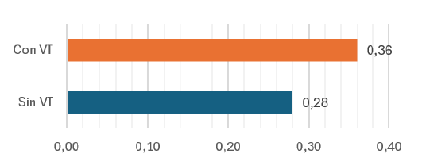
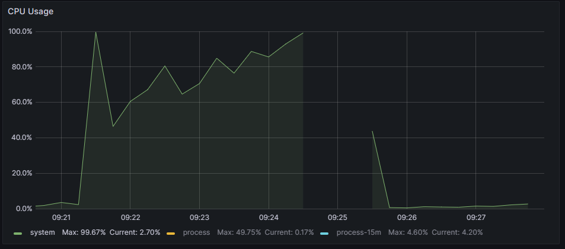
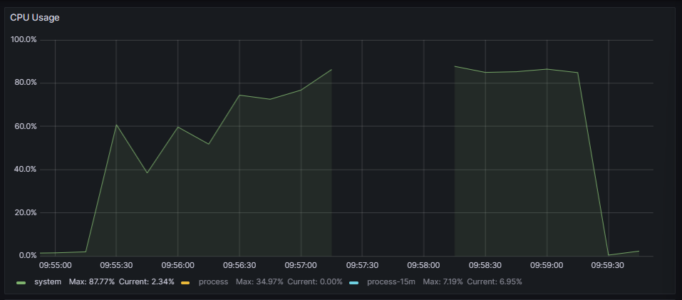
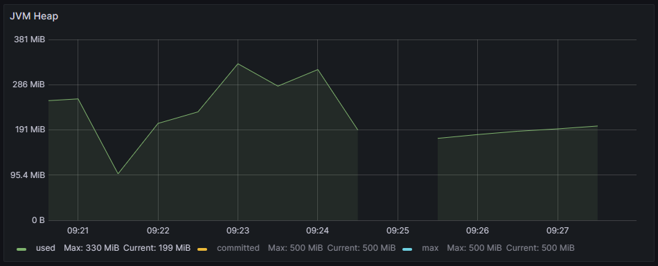
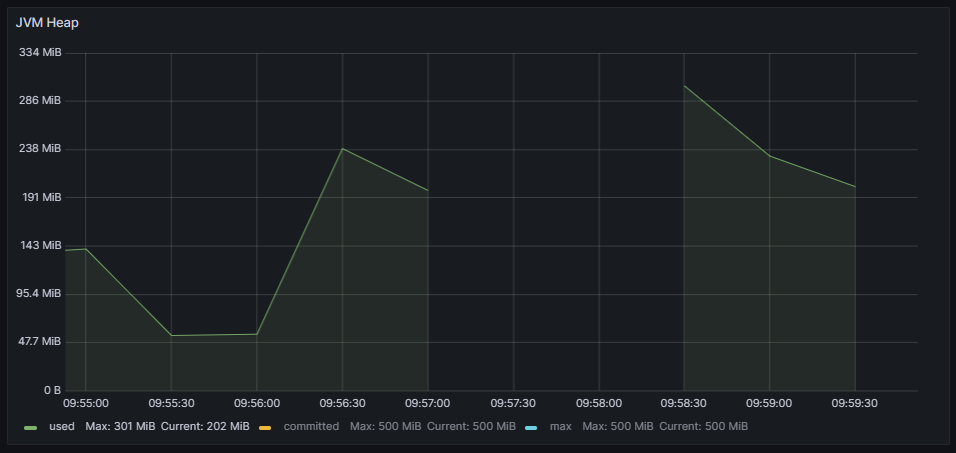
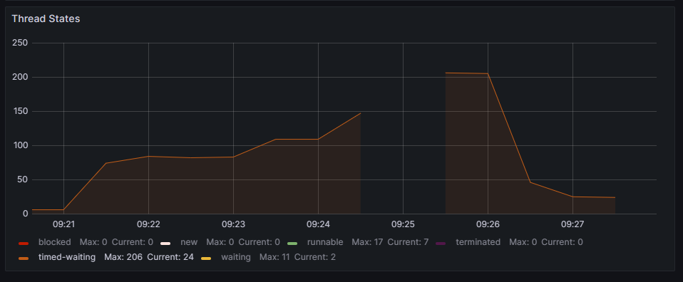
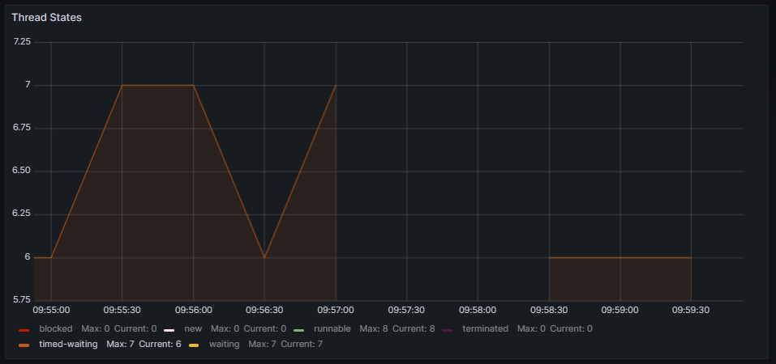
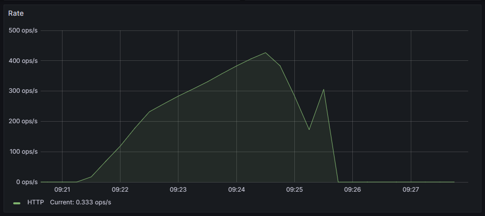
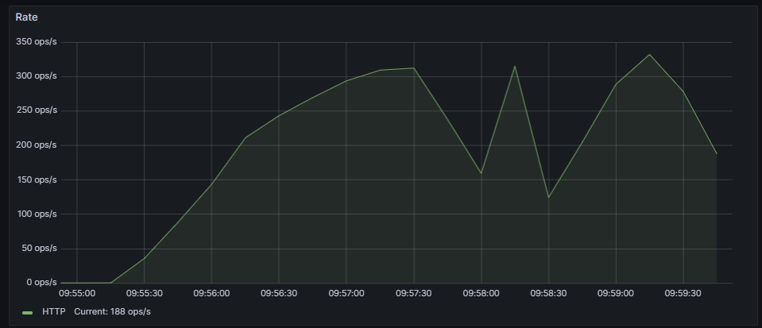

# Virtual Threads usage Comparison: Spring Boot - Blocking programming approach - Mysql 

## Response times analysis
The results regarding response times (expressed in milliseconds) are shown in the following graph:

The timeout percentages for both executions are:

## Resources usage analysis

|   | Without Virtual Threads | With Virtual Threads |
|---|---|---|
| CPU |  |  |
| JVM Heap |  |  |
| Threads usage |  |  |
| response rate |  |  |

Regarding resource management, the JVM heap had a similar load in both executions. On the other hand, CPU usage was high in both cases.

In both executions, there was a brief period when the application had such a high workload that it was unable to send performance metrics to Grafana. In the execution without virtual threads, the CPU usage reached 100%, whereas with virtual threads, the maximum usage was 87.77%.

Lastly, concerning processor threads, during the execution over platform threads, there were up to 206 blocked threads. In contrast, with virtual threads, there were only 7 blocked threads.

## Conclusion

Therefore, it is concluded that despite a slight improvement in CPU management, the usage of virtual threads during execution of an applications that use Spring Boot, a MySQL database, and a blocking programming model degrades performance.

This result may seem counterintuitive since theory suggests that virtual threads should improve performance. It is possible that some library used for communication with the MySQL database is not optimized or well-implemented for execution on virtual threads, leading to the performance drop.
