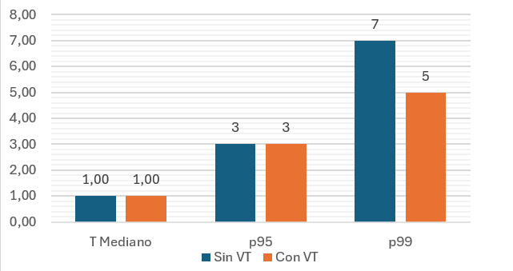
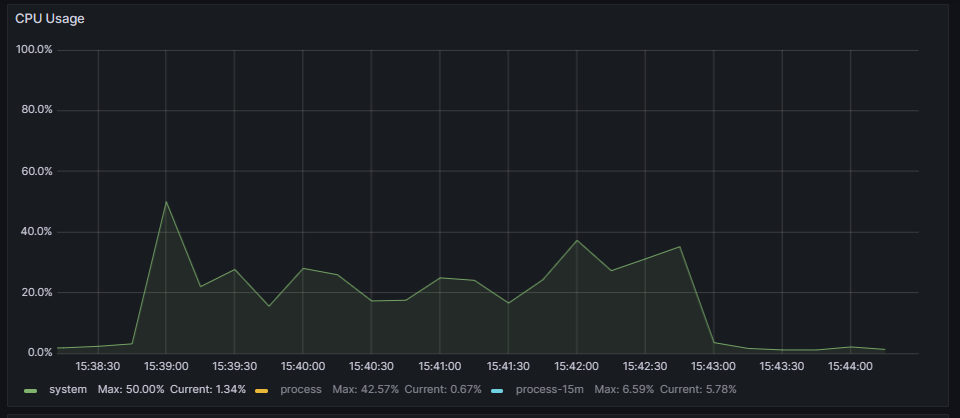
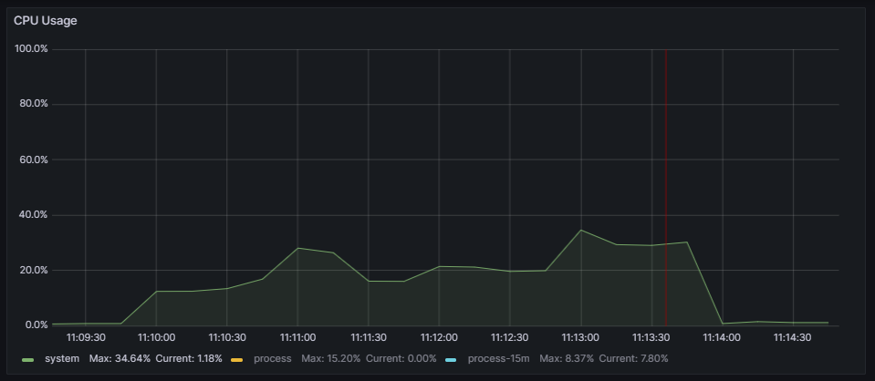
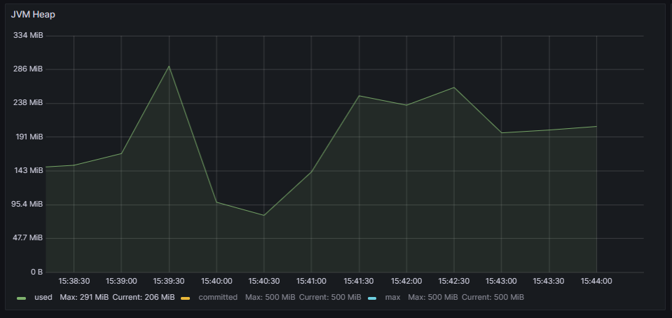
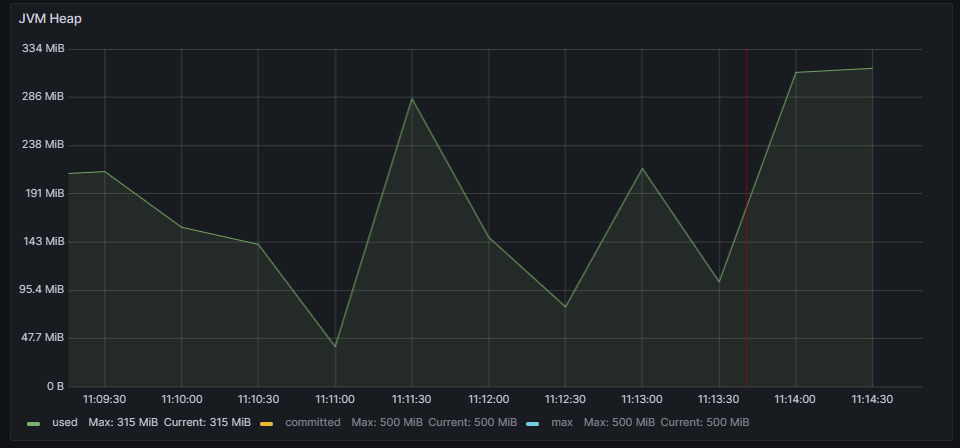
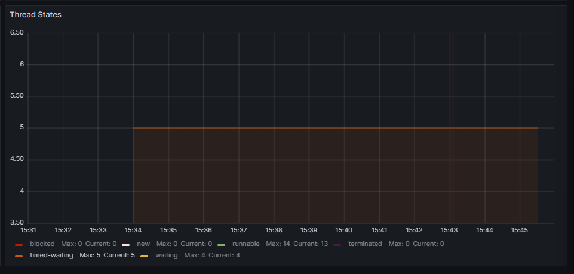
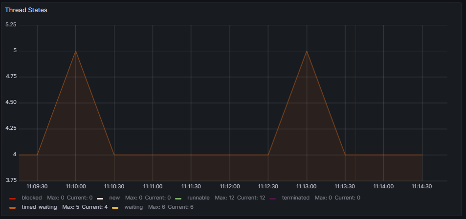

# Virtual Threads usage Comparison: Spring Boot - Non blocking programming approach - MongoDB 

## Response times analysis
The results regarding response times (expressed in milliseconds) are shown in the following graph:

Similarly to the [Spring boot  blocking -mongoDB comparison](../SpringBoot_Blocking_MongoDB/), the time response results are almost identical.

## Resources management analysis

|   | Without Virtual Threads | With Virtual Threads |
|---|---|---|
| CPU |  |  |
| JVM Heap |  |  |
| Threads usage |  |  |

Regarding resource efficiency, the version using virtual threads slightly improves CPU usage efficiency, while the JVM memory usage percentage and thread management are very similar.

## Conclusion

It can be concluded that performance is slightly better when execution is done using virtual threads, but the improvement is practically imperceptible from the user's perspective.

