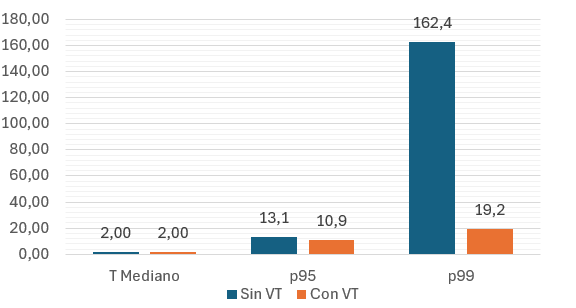
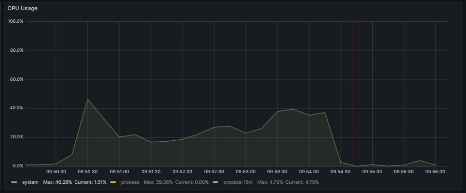
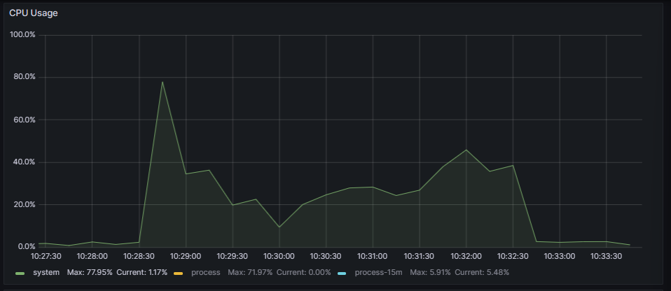
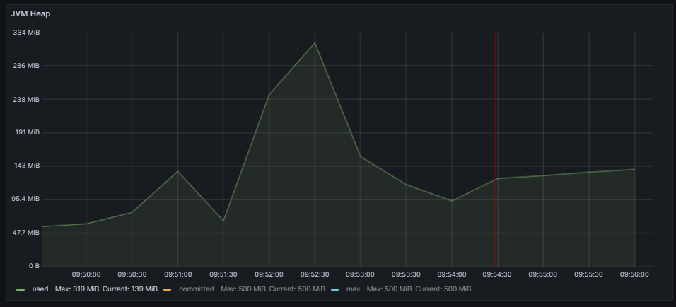
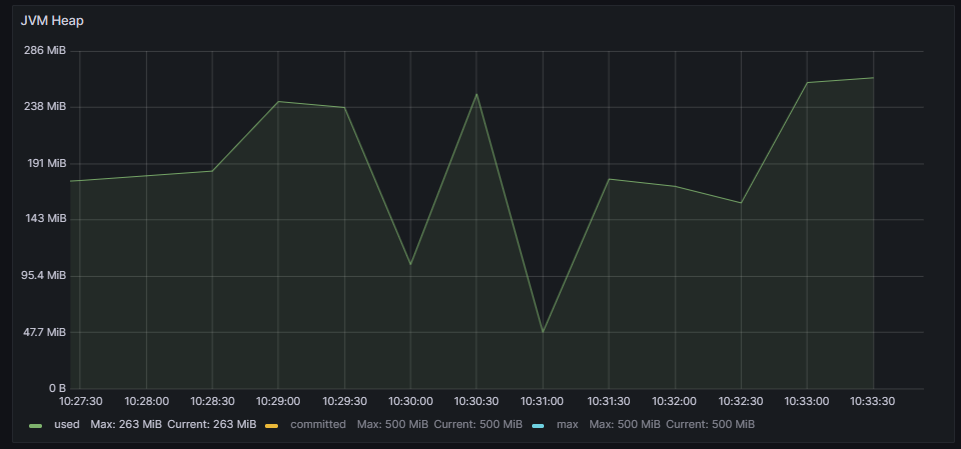
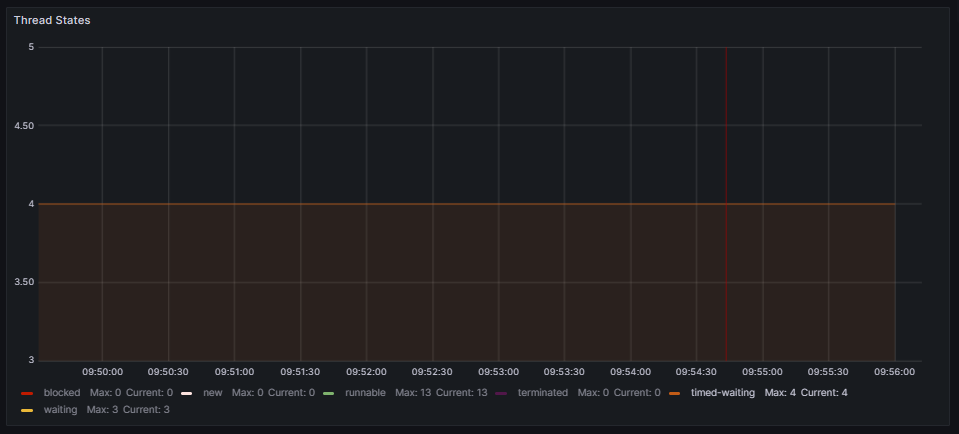
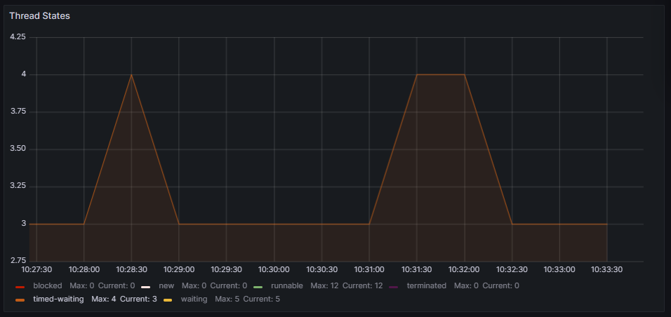

# Virtual Threads usage Comparison: Spring Boot - Blocking programming approach - Mysql 

## Response times analysis
The results regarding response times (expressed in milliseconds) are shown in the following graph:

The response times are similar for both executions, except for the 99th percentile, which is higher when virtual threads are not used.
In both cases, the requests per second ratio reached the maximum of 500, and there were no failed requests.

## Resources management analysis

|   | Without Virtual Threads | With Virtual Threads |
|---|---|---|
| CPU |  |  |
| JVM Heap |  |  |
| Threads usage |  |  |

Regarding CPU usage, it is similar in both cases despite a small peak of 77% when using virtual threads.

The maximum JVM memory usage during execution without virtual threads was 68%, while with virtual threads, it was 52.6%.

## Conclusion

After analyzing the data, it seems that the performance in both versions is similar. This makes sense since, even in the execution without virtual threads, a strategy that avoids blocking platform threads is used. Therefore, virtual threads do not provide a significant advantage in this case. In fact, in both cases, the application had only up to four blocked threads consistently during execution.

However, the management of the JVM memory improved by nearly 14% with the use of virtual threads.